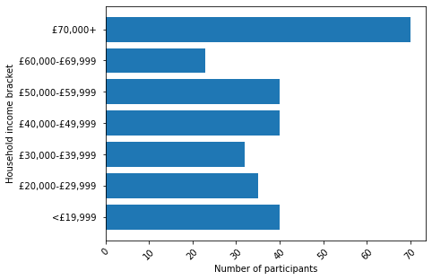
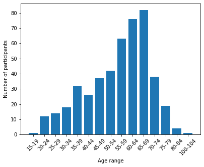

<!DOCTYPE html>
<html>
    
<head>
<title>Page Title</title>
</head>
<body>

<h1>A breakdown of the people who have contributed to the survey test</h1>

Below you will find several graphics showing information about who completed the survey.

<iframe src="https://jen-rasal.github.io/KnittingSurvey/knitting_responses_map.html" width="925" height="550"></iframe>

    

    </body>
</html>
